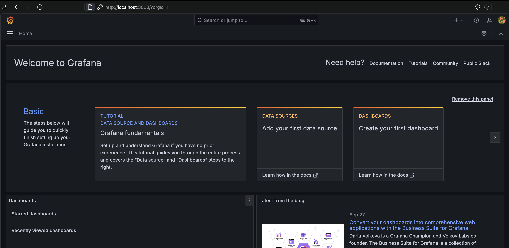
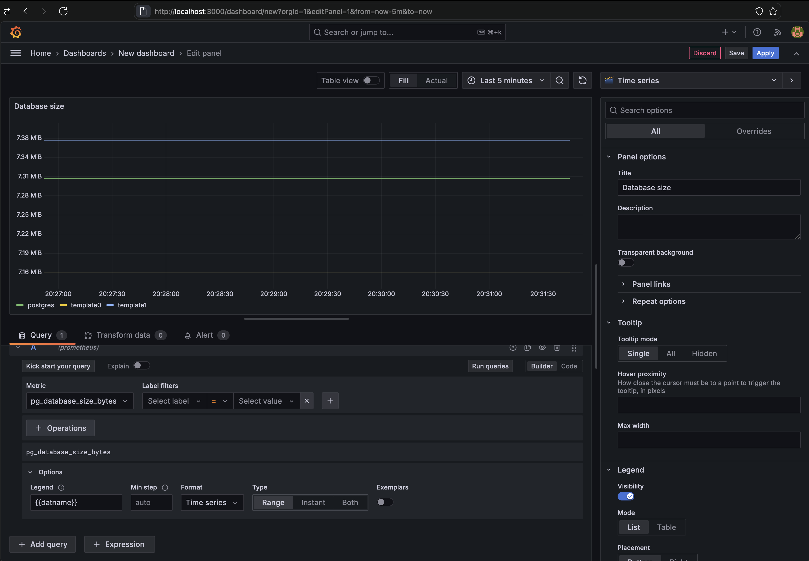
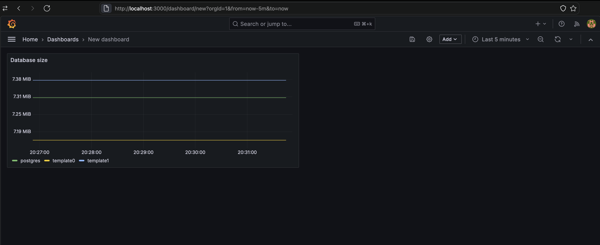

# Лабораторная работа №5

## Обязательное задание

### Введение

В данной лабораторной работе необходимо сделать мониторинг сервиса, поднятого в Kubernetes и показать хотя бы два рабочих графика, которые будут отражать состояние системы.

### Подготовка Kubernetes

Перед установкой всех необходимых пакетов было создано пространство имен `monitoring` с помощью следующий команды:

```bash
kubectl create namespace monitoring
```

После этого оно было выбрано в качестве текущего пространства имен:

```bash
kubectl config set-context --current --namespace=monitoring
```

### Установка необходимых пакетов

#### Установка PostgreSQL

В качестве приложения, для которого будут собираться метрики, был выбран PostgreSQL. Для установки и развертывания PostgreSQL в Kubernetes использовался менеджер пакетов Helm:

```bash
helm install my-postgresql oci://registry-1.docker.io/bitnamicharts/postgresql
```

После этого необходимо было настроить PostgreSQL на сбор метрик. Так как по умолчанию сбор метрик отключен, то для включения сбора метрик был создан файл `postgresql/values.yaml` для переопределения настроек по умолчанию:

```yaml
metrics:
  enabled: true
```

После этого было выполнено обновление конфигурации с помощью следующей команды:

```bash
helm upgrade -f postgresql/values.yaml my-postgresql oci://registry-1.docker.io/bitnamicharts/postgresql
```

#### Установка Prometeus

Для установки Prometeus был добавлен репозиторий `prometheus-community`. Затем был установлен пакет `prometheus` из добавленного репозитория:

```bash
helm repo add prometheus-community https://prometheus-community.github.io/helm-charts
helm install my-prometheus prometheus-community/prometheus
```

#### Установка Grafana

Для установки Grafana был добавлен репозиторий `grafana`. Затем был установлен пакет `grafana` из добавленного репозитория:

```bash
helm repo add grafana https://grafana.github.io/helm-charts
helm install my-grafana grafana/grafana
```

### Настройка Grafana

Для получения информации, необходимой для подключения к Grafana, использовалась следующая команда:

```bash
helm status my-grafana
```

После ее выполнения на экран были выведены инструкции для получения пароля от аккаунта администратора, а также имени пода. С помощью следующей команды был включен проброс портов в под Grafana:

```bash
kubectl --namespace monitoring port-forward $POD_NAME 3000
```

Перейдя по ссылке `http://localhost:3000`, получили следующую страницу:


Введя данные аккаунта, полученные ранее, получили следующую страницу:



В разделе «Connections -> Data sources» был добавлен источник данных Prometheus. В качестве адреса сервера был указан адрес `http://my-prometheus-server.monitoring.svc.cluster.local`:


После перехода в раздел «Dashboards» был создан дашборд, который будет использоваться для просмотра метрик.


С помощью кнопок «Add -> Visualization» был добавлен первый график. В качестве примера была выбрана метрика `pg_database_size_bytes`, которая показывает размеры баз данных в PostgreSQL. С помощью Query Builder был настроен следующий график:



После сохранения изменений, новый график появился на дашборде:



Таким же образом были добавлены еще три графика:

1. График количества соединений.
2. График uptime.
3. График задержки выполнения запросов.

Все они представлены на следующем рисунке:


### Заключение

В данной лабораторной работе был сделан мониторинг PostgreSQL на основе Grafana и Prometheus, поднятого в Kubernetes.

## Задание со звездочкой
